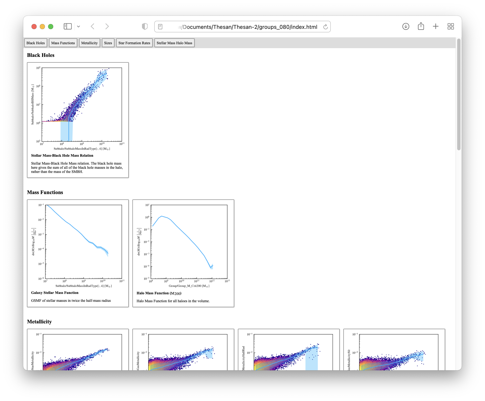

Page Plot
=========

One very useful thing to have when developing numerical models is an ability
to rapidly generate a series of diagnostic figures. Usually, you will want
the same number and type of figures each and every time, which usually come
down to a series of scatter plots (with and without binning lines) alongside
some additional data from external sources.

There are a number of ways to do this; you can maintain a set of scripts to
create each plot, or use a dashboard system (like
[Plotly Dash](https://dash.plotly.com/)). Both of these come along with
downsides; for the individual scripts, a lot of time can be spent maintaining
shared code that is frequently copied and pasted between scripts. Those
scripts are essentially just boilerplate, with lots of calls to matplotlib's
API, or a series of pandas calls. Dashboards are tricky in a HPC environment
as they require hosting, and as such are significantly less portable.

PagePlot attempts to slot in-between these solutions. It is a low-code
solution, with the code being used to describe the data format to PagePlot,
with no-code plotting. The figures can then be used to create a static,
portable, dashboard.

PagePlot attempts to succeed the successful
[swift-pipeline](https://github.com/swiftsim/pipeline) project and
generalise it for use throughout the community.


Codeless Plotting
-----------------

A typical diagnostic plot may include a scatter of two variables, along
side a median line to demonstrate the overall trend. Let's take a look at how
that would be done in a typical python script:

```python

import matploylib.pyplot as plt
import numpy as np
import h5py

x_low, x_high = [1e7, 1e10] # cm / s
y_low, y_high = [1e3, 1e9] # km
n_bins = 24

with h5py.File("my_file.hdf5", "r") as handle:
    x_data = handle["/My/X/Data"][:] * 1e5 # km / s to cm / s
    y_data = handle["/My/Y/Data"][:] # km


bins = np.logspace(np.log10(x_low), np.log10(x_high), n_bins)

# ... Your favourite code that does median binning, but produces
bin_centers = ...
medians = ...
scatters = ...

fig, ax = plt.subplots()

ax.set_xscale("log")
ax.set_yscale("log")

ax.scatter(x_data, y_data)

ax.errorbar(bin_centers, medians, scatters)

ax.set_xlim(x_low, x_high)
ax.set_ylim(y_low, y_high)

ax.set_xlabel("X quantity [cm / s]")
ax.set_ylabel("Y quantity [km]")

fig.savefig("test.png")
```

Seems pretty simple, right? All is well when this is one script, dealing with
a fixed data source, with consistent units. The problems originate when you
have changing data (what happens to this script when the simulation software
starts outputting the `x_data` in `cm / s`?), multiple people with different
ideas on how median lines (or other intermediate products) should be created
(should the bin center be placed at the median `x` value or at the midpoint
of the bin edges?), the data should be displayed and visualised
(shaded regions, v.s. error bars, and so-on), all with different packages
used to process the data. This rapidly becomes a big mess (if you're looking
at this package - you've probably been there).

This code doesn't even need to exist. Here, we're just specifying that you would
like a plot of `x` against `y`. I could just as easily have specified this as:

```json
{
    "test": {
        "x": "/My/X/Data",
        "y": "/My/Y/Data",
        "x_units": "cm/s",
        "y_units": "km",
        "median_line": {
            "limits": ["1e7 cm/s", "1e10 cm/s"],
            "bins": 24
        },
        "axes_limits": {
            "limits_x": ["1e7 cm/s", "1e10 cm/s"],
            "limits_y": ["1e3 km", "1e9 km"]
        },
        "scale_axes": {
            "scale_x": "log",
            "scale_y": "log"
        }
    }
}
```

This contains the exact same amount of information (barring the internal data
units from the file, but those should be stored as metadata in the file
anyway). It's much shorter, and is importantly implementation-independent.
I could use this JSON to pass to a `R` script that understands it, or even
write some intermediary to allow `ggplot` to understand it. This JSON
(very convienently) happens to have the exact format used in `PagePlot`.
The library can then control the way that data is processed, and the styling
and output options for the figures in a fully consistent way.


Interfacing With Page Plot
--------------------------

Page Plot is built out of three major components:

1. A data object that conforms to the `IOSpecification`. This effectively needs
   a way of taking your chosen file and loading a relevant one dimensional array
   (with included units using `unyt`) from a string. The string is what is given
   to the `x`, `y`, and `z` parameters in the JSON.
2. A series of extensions (built in, and external) that conform to the
   `PlotExtension` specification. These can compute derived data, interact
   directly with the `matplotlib.Axes` and `matplotlib.Figure` objects, and
   even with the filesystem. The attributes of the `PlotExtension` objects
   correspond directly to the JSON attributes in the configuration files.
3. Glue that holds all of these pieces together, and even allows for the
   production of webpages that allow for all figures to be displayed alongside
   each other as a summary page.


About Those Webpages
--------------------

One of the built in extensions in `PagePlot` is called `metadata`, and has the
specification:

```json
"metadata" {
    "comment": "Descriptive comment, saved out to serialized data",
    "title": "Plot title, for use on webpage",
    "caption": "Wepbage caption for plot",
    "section": "Section on webpage to use",
}
```

This metadata is primarily used to populate the webpages that `PagePlot` is
able to produce (hence the name `PagePlot`). These pages are split into
sections, with each figure in each section having a title and caption. The
pages are made out of a simple, static, HTML in a single page, so sharing the
folder of plot files and the `index.html` is enough to fully share a
diagnostic output. 


Putting it all Together
-----------------------

Running `PagePlot` is very simple. At the moment, as the API is a little in flux,
there's no specific command line tool (but there will be one in the future)!

The script below takes in a data filename from the first argument, and runs all
of the `PagePlot` infrastructure.

```python
"""
Runs PagePlot.
"""

from pathlib import Path
from pageplot.runner import PagePlotRunner
from pageplot.io.areposubfind import IOAREPOSubFind
import sys

data_filename = Path(sys.argv[1])

config_loc = Path("/Global/Path/To/Config")
config_files = list(config_loc.glob("*.json"))
global_config_file = config_loc / Path("config.json")

config_files.remove(global_config_file)

runner = PagePlotRunner(
    config_filename=global_config_file,
    data=IOAREPOSubFind(filename=data_filename),
    plot_filenames=config_files,
)

runner.create_figures()
runner.create_webpage()
```

In `/Global/Path/To/Config/black_holes.json`, we have:
```json
{   
    "stellar_mass_black_hole_mass": {
        "two_dimensional_histogram": {
            "limits_x": ["1e7 Solar_Mass", "1e11 Solar_Mass"],
            "limits_y": ["1e5 Solar_Mass", "1e9 Solar_Mass"],
            "spacing_x": "log",
            "spacing_y": "log",
            "bins": 128,
            "norm": "log"
        },
        "median_line": {
            "limits": ["1e7 Solar_Mass", "1e11 Solar_Mass"],
            "display_as": "shaded",
            "spacing": "log",
            "bins": 20
        },
        "scale_axes": {
            "scale_x": "log",
            "scale_y": "log"
        },
        "axes_limits": {
            "limits_x": ["1e7 Solar_Mass", "1e11 Solar_Mass"],
            "limits_y": ["1e5 Solar_Mass", "1e9 Solar_Mass"]
        },
        "legend": {},
        "x": "Subhalo/SubhaloMassInRadType[:, 4]",
        "y": "Subhalo/SubhaloBHMass",
        "x_units": "Solar_Mass",
        "y_units": "Solar_Mass",
        "metadata": {
            "caption": "Stellar Mass-Black Hole Mass relation. The black hole mass here gives the sum of all of the black hole masses in the halo, rather than the mass of the SMBH.",
            "section": "Black Holes",
            "title": "Stellar Mass-Black Hole Mass Relation"
        }
    }
}

```
As well as a small config file `config.json`,
```json
{
    "stylesheet": "/Global/Path/To/Config/mnras.mplstyle"
}
```
There are other plot specification files included, too, but they're omitted
here for brevity.

Once ran on an appropriate (Illustris-TNG) data file, for which there
is a built in `IOSpecification` called `IOAREPOSubFind`, this produces
a webpage that looks like:

